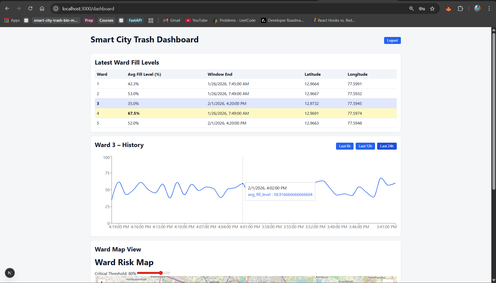
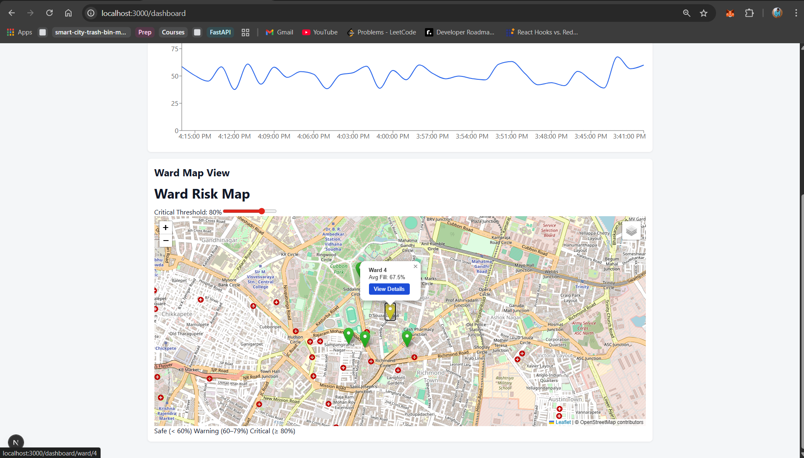
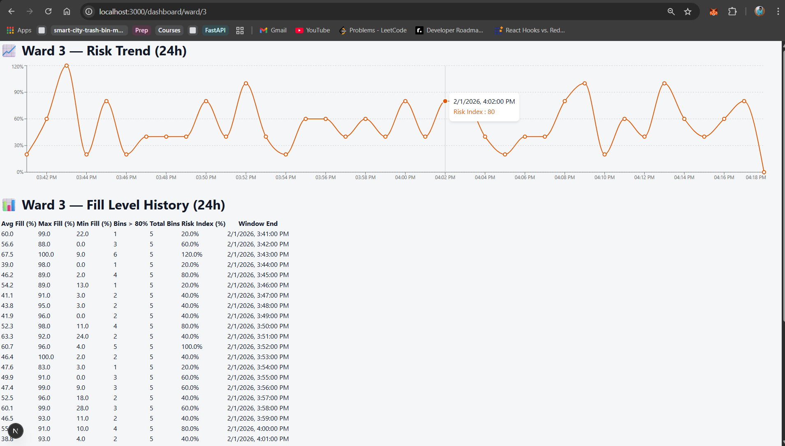

# 🚮 Smart City Trash Bin Monitor 🏙️

## 📌 Introduction
Smart City Trash Bin Monitor is a **real-time data engineering project** that simulates and processes IoT-enabled trash bin data using a **fault-tolerant streaming architecture**.  
The project focuses on building a **production-grade streaming pipeline** that ingests sensor data, cleans and aggregates it in real time, and stores reliable results for downstream consumption.

This repository currently implements the **core real-time data pipeline** with strong guarantees around **performance, reliability, and maintainability**.

---

## 📖 Project Description
Modern cities generate continuous streams of waste management data from smart bins deployed across wards and zones.  
This project demonstrates how such data can be:

- Ingested in real time
- Validated and cleaned safely
- Processed with **exactly-once semantics**
- Persisted reliably even during failures
- Scaled and maintained using best practices

The emphasis of this project is **data engineering correctness and robustness**, not just data movement.

---

## 🎯 Objectives (Implemented)
- Real-time ingestion of trash bin sensor data
- Validation and isolation of malformed events (DLQ)
- Deduplication and late-event handling
- Ward-level and bin-level aggregations
- Fault-tolerant persistence with retries
- Low-latency analytics APIs
- Caching and rate-limited backend access
- Environment-driven, Dockerized deployment

---

## 🧠 Key Features (Current Implementation)

### ✅ Real-Time Data Ingestion
- Kafka-based ingestion pipeline
- Controlled ingestion rate using `maxOffsetsPerTrigger`
- Separate handling for valid and invalid events

### ✅ Stream Processing with Spark Structured Streaming
- Stateful processing with watermarking
- Deduplication based on business keys
- Windowed aggregations (ward-wise fill levels)
- Exactly-once guarantees using checkpointing

### ✅ Dead Letter Queue (DLQ)
- Invalid or malformed events routed to a dedicated Kafka topic
- DLQ is isolated and does not block the main pipeline
- Full auditability of bad data

### ✅ Fault Tolerance & Recovery
- Safe `foreachBatch` execution
- Database retries with exponential backoff
- Automatic recovery from Spark restarts
- No duplicate writes due to idempotent UPSERTs

### ✅ Backend APIs (FastAPI)
- REST APIs to serve:
  - Latest ward metrics
  - Bin-level fill status
  - Risk analysis & thresholds
  - Historical summaries
- JWT-based authentication
- Role-aware access control (admin / user)

### ✅ Redis Caching Layer
- Redis used to cache frequently accessed analytics
- Reduces database load on high-traffic endpoints

### ✅ Rate Limiting & Security
- User-key / username-based rate limiting
- Prevents API abuse (no IP dependency)
- Secure cookie / token-based authentication

### ✅ Frontend Dashboard (Next.js + Leaflet)
- Interactive dashboard built using Next.js
- Real-time ward & bin visualization using Leaflet maps
- Color-coded bins/wards based on fill level and risk
- Charts and summary cards driven by backend APIs
- Production-style layout similar to enterprise analytics dashboards

### ✅ Real-Time Alerts & Risk Visualization
- Configurable overflow and risk thresholds
- Backend-computed risk levels exposed via APIs
- Frontend highlights high-risk bins and wards visually
- Supports proactive waste collection planning

### ✅ Maintainable & Configurable
- All infrastructure config externalized via environment variables
- Schema versioning for forward compatibility
- Clean modular Spark job structure

---

## 🏗️ Current Architecture (Implemented)

- Data Simulator (Python)
- ↓
- Apache Kafka
- ├── valid-trash-bin-data
- └── invalid-trash-bin-data (DLQ)
- ↓
- Apache Spark Structured Streaming
- ↓
- PostgreSQL (Aggregated Results)
- ↓
- Redis
- ↓
- FastAPI Backend
- ↓
- Next.js Dashboard
              └── Leaflet Maps
              └── Critical Alerts
              
---

## 🧰 Tech Stack (Implemented)

| Layer | Technology |
|-----|-----------|
| Data Simulation | Python |
| Streaming Ingestion | Apache Kafka |
| Stream Processing | Apache Spark Structured Streaming |
| Fault Handling | Kafka Dead Letter Queue |
| Data Storage | PostgreSQL |
| Containerization | Docker & Docker Compose |
| Language | Python |
| Observability | Spark StreamingQueryListener |
| Frontend | Next.js, Tailwind CSS |
| Maps & Visualization | Leaflet |
| Charts | Recharts |

---

## 🚀 How to Run (Current)

- git clone (https://github.com/AbhiSathya/smart_city_trash_bin_monitor.git)

- cd smart-city-trash-bin-monitor

- docker compose up --build

Spark will:

- Consume live Kafka data

- Process valid events

- Route invalid events to DLQ

- Persist aggregated results into PostgreSQL

---

## 🧪 Failure Scenarios Handled

- Invalid JSON → routed to DLQ
- Duplicate events → deduplicated
- Late events → handled via watermarking
- PostgreSQL downtime → retried safely
- Spark restart → resumes from checkpoint
- High API traffic → handled via Redis + rate limiting

---

## 📸 Screenshots

### Dashboard

### Smart City Map 

### Ward Analysis

---

## 🔮 Planned Enhancements (Not Implemented Yet)
The following features are intentionally not implemented yet and are planned as future phases:
- Alerting system (overflow thresholds)
- Route optimization & prediction logic
- Historical batch analytics
- Airflow-based orchestration
